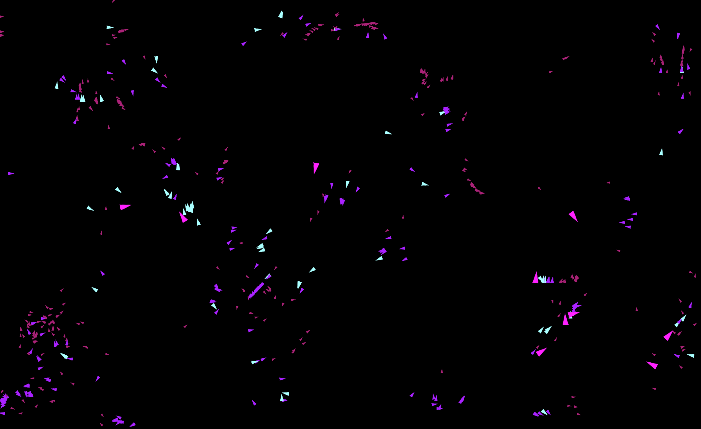

  <h1><code>wasm-boids</code></h1>

  <strong>Flocking Birds as WebAssembly NPM package thanks to <a href="https://github.com/rustwasm/wasm-pack">wasm-pack</a>.</strong>

  Built with 🦀🕸 by <a href="https://nsimon.fr">nSimon</a> based on work from <a href="https://rustwasm.github.io/">The Rust and WebAssembly Working Group</a>

## 📚 About

Implements `Boid`, `Vec2d`, `Universe` & `Rules` - scales better than my previous JS-based implementation.

Based on the original paper on Boids by [Craig Reynolds](https://www.red3d.com/cwr/boids/) and the wasm tutorial [wasm-game-of-life](https://rustwasm.github.io/docs/book/game-of-life/introduction.html).

## 🚴 Usage

Example in HTML Canvas thanks to [PixiJS](https://pixijs.download/): 1000-random sized and colored boid with wall avoidance and mouse attraction => [example](./example)

## 📝 TODO

- Better boid detection (Currently very naive box detection - should consider using [Parry](https://github.com/dimforge/parry))
- 3D implementation